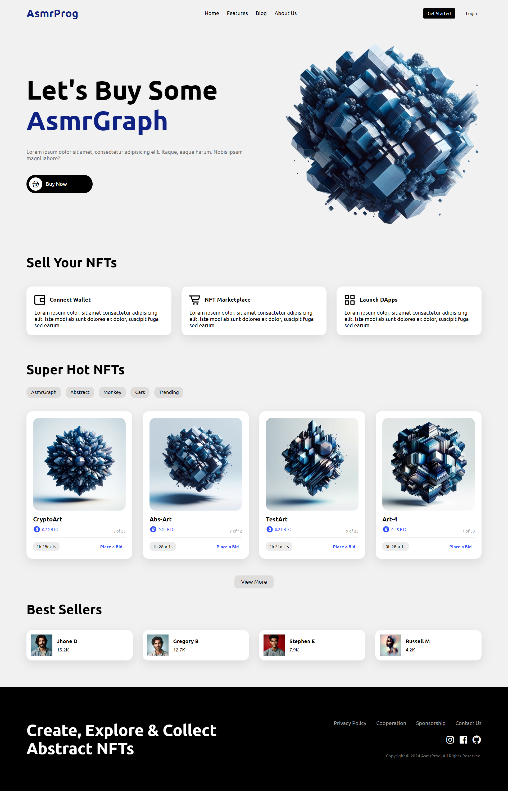

# Responsive NFT Website

In this tutorial ([Open in Youtube](https://youtu.be/lzGP_DKXMlA)), I'm going to show you how to use modern HTML and CSS to create a completely responsive NFT Website with awesome color theme. We'll be using CSS Flexbox, Media queries for our responsive design and CSS  transition for some cool animation effects. This project contains NFT Marketplace, Best Sellers, Guarantee, Footer, Navbar and a Header section😉

# Screenshot
Here we have project screenshot :

